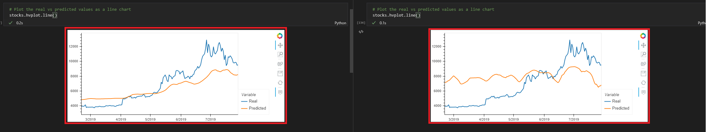

# LSTM Stock Predictor


## Preprocessing Data

* ```both notebooks have the same process where it seperates you will see a *=>() to indicate a seperation in the process from notebooks```

* Data is pulled from 2 CSV files in the [Data](./Data) folder which are joined together into one DataFrame

* Features and target are distinguished *=>(for the ```*_fng.ipynb``` file the fng values are used as the feature(s) while the ````*_closing.ipynb``` file the close column is used for both feature and target)

* Data is split into training(70%) and testing(30%) groups

* Utilizing ```MinMaxScaler()``` both sets of train and test data is transformed

* Feature are reshaped to fit the model

## Building the Model

* A ```Sequential()``` nerual network model is created with 3 LSTM layers a Dropout layer after each LSTM layer and a final Output layer

* neural network model is compiled and fitted with training data

# Model Performance

* Overall it seems fitting the model with FNG data was less sufficient than analyzing past closing prices

* To demontrate this with different parameters here are the different batch sizes tested and one ran with more epochs
* The Left is Closing Prices data and the Right is FNG data





# Conclusion

* It seems as though fitting the model with closing prices to estimate closing prices yields the best results and also seems to make the most sence since itself would be the most relevant data to itself

* Overall less seemed to pay out more for the better model and the less batch size and epochs the better it seemed to do up until a certain point of course (```batch_size > 30 && epochs > 5```)