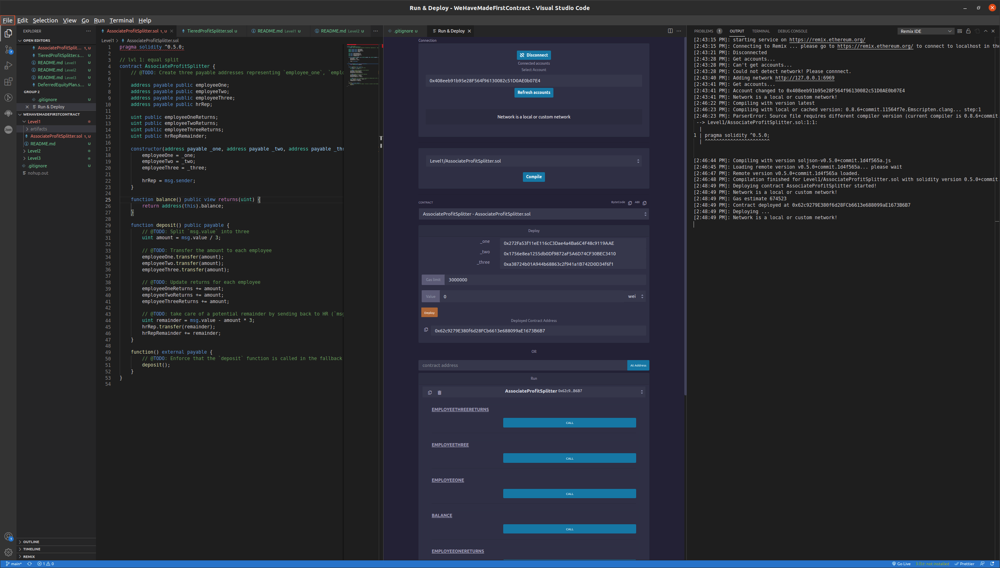
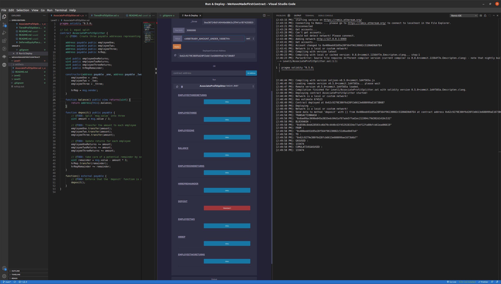
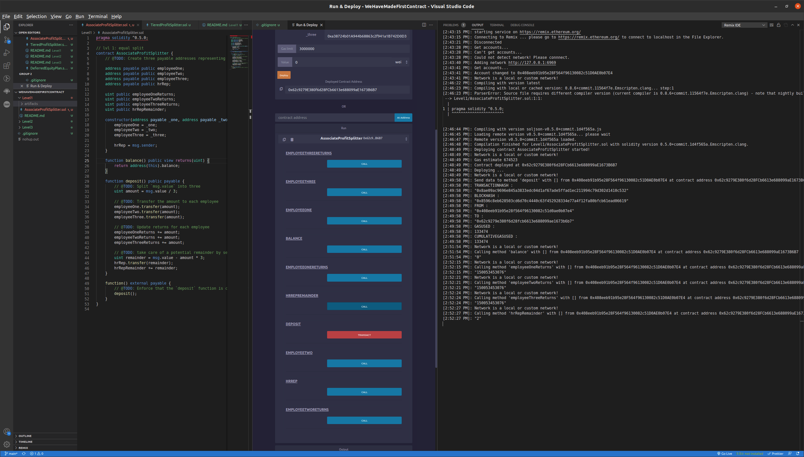

# Associate Profit Splitter

* A contract that splits a deposit three ways between 3 seperate addresses evenly

## Deploy

### Contract is first compiled to check for errors
### Each parameter is filled with the appropriate data type
### Orange deploy button initiates deployment and success message is received with interface and contract address 

 
 

## Deposit

### In the 'value' field an arbitrary amount under 1000 eth is inputted
### The deposit function is called which handles the splitting of dividends between employees plus the remainder funneled to HR

 
 

## Balance Check

### Balance of each employee is called and compared for exact match
### Balance of HR is called to check on remainder handler
### Balance of contract is called to make sure it is equivalent to 0

 
 
 

# Utilization

## Rewards/Bonuses

* Can automatically distribute rewards at set periods
* Distribution is even and fair

## Commission

* Profit sharing can be processed quickly and seemlessly
* Calculations are trusted by an algorithm instead of by a user

## Common Pay

* Can be distributed without interference and can limit disputes
* Maybe faster than traditional pay systems