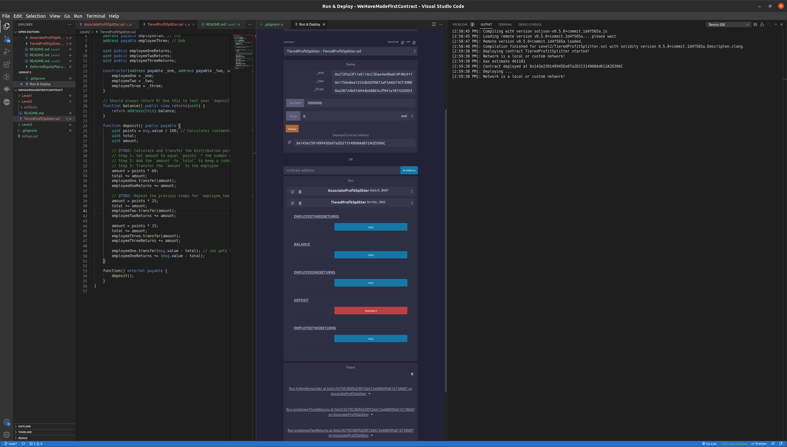
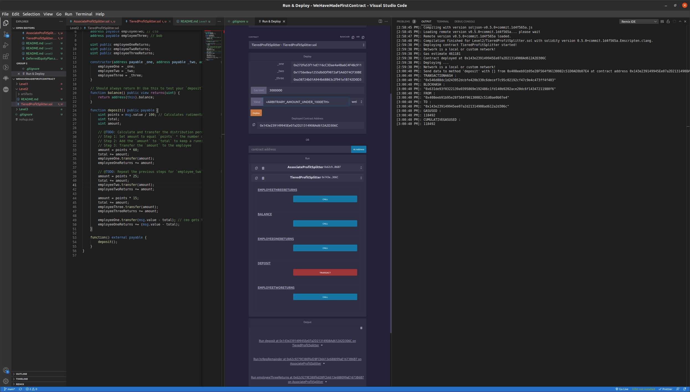
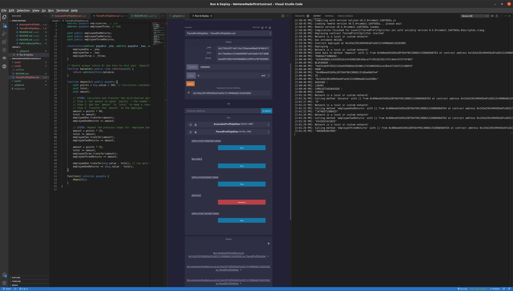

# Tiered Profit Splitter

* A contract that splits a deposit 3 ways by percentage weighting for 3 seperate addresses

## Deploy

### Contract is first compiled to check for errors
### Each parameter is filled with the appropriate data type
### Orange deploy button initiates deployment and success message is received with interface and contract address 

 
 

## Deposit

### In the 'value' field an arbitrary amount under 1000 eth is inputted
### The deposit function is called which handles the splitting of dividends by percentage between employees
### The remainder is funneled to the CEO AKA employeeOne

 
 

## Balance Check

### Balance of each employee is called and compared for appropriate percentage split
### Balance of contract is called to make sure it is equivalent to 0

 
 
 

# Utilization

## Even Wage

* Each profession will have the equivalent pay regardless of identity or favortism
* Specializations can have benchmark wages to compare for other positions

## Public

* Pay is known by all employees so that discrepancy against unfair wage is easier to identify
* Adjustments can be made for those that do not have a fair work/compensation ratio