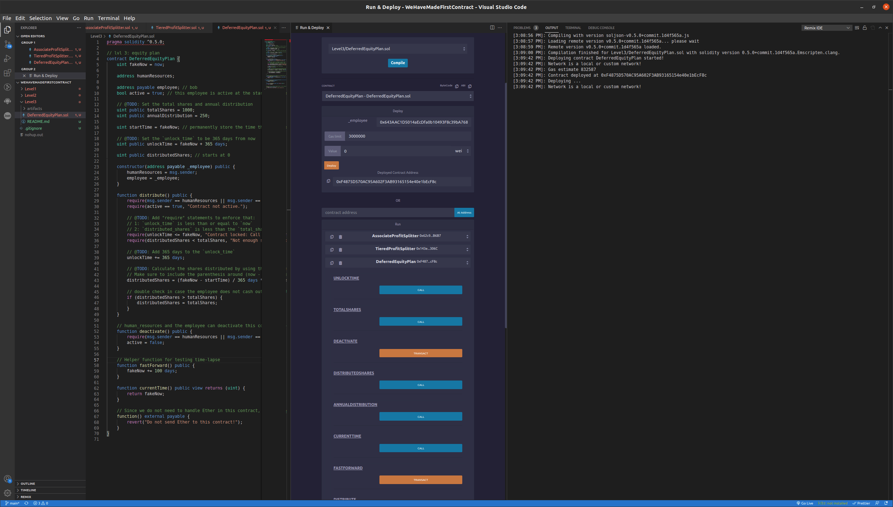
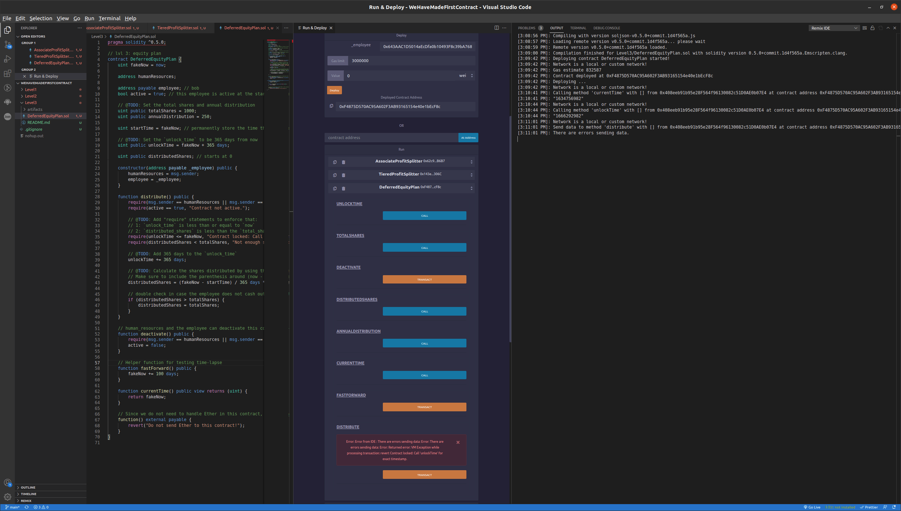
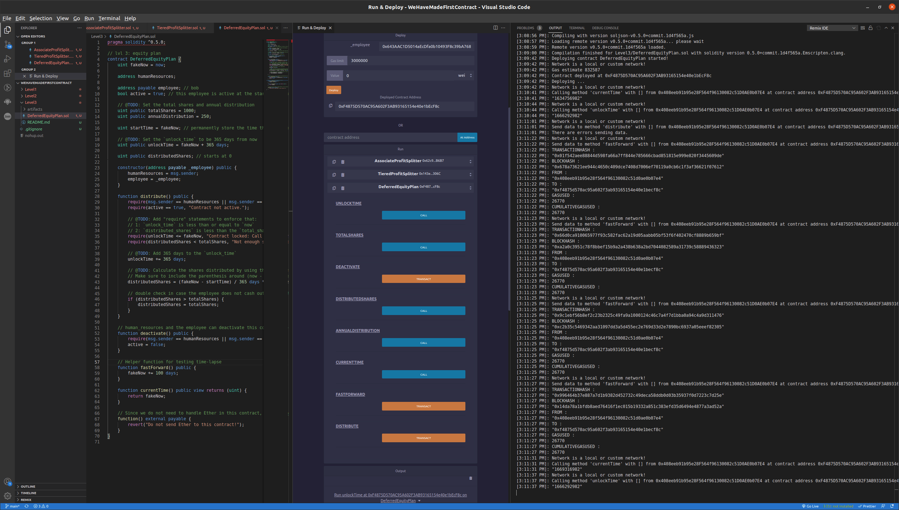
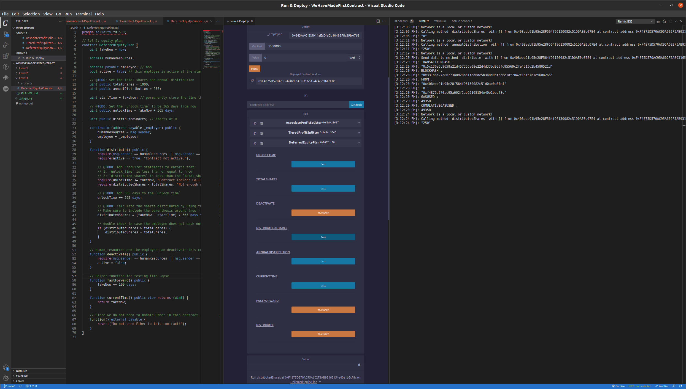
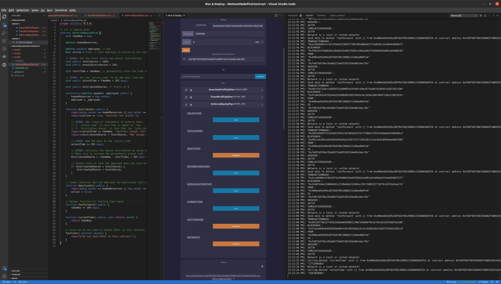
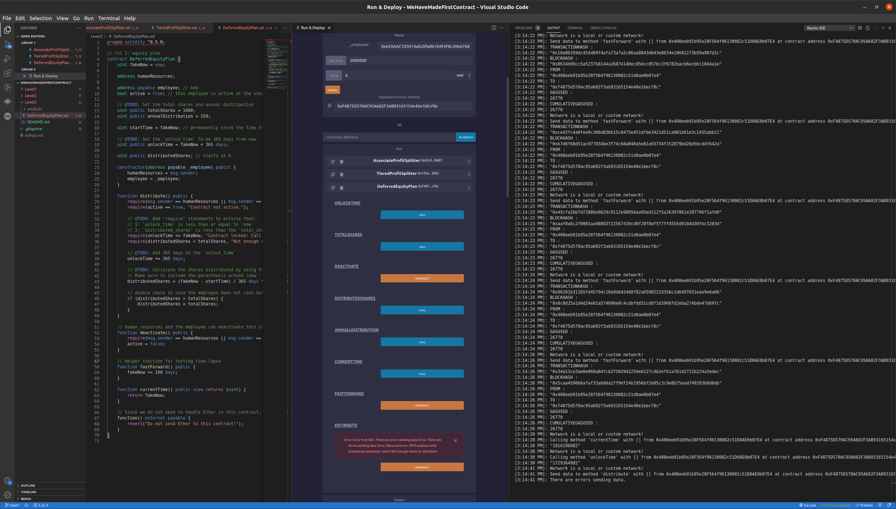

# Deferred Equity Plan

* A contract that divvies out portions of total shares over a set period of time (in this case once per 365 days)

 

## Deploy

### Contract is first compiled to check for errors
### Address inputted for employee receiving dividends
### Orange deploy button initiates deployment and success message is received with interface and contract address

 
 

## Shares Distributed Too Early

### Current time and unlock time are called to make sure current time is under unlock time
### Distribute is called and expected to fail since shares are not unlocked

 
 

## Fast Forward Time One Year

### Fast forward is called enough times to unlock shares
### Current time and unlock time are compared to make sure current time is larger

 
 

## Distribute Shares After One Year

### Distributed shares are checked to make sure they are 0
### Shares are distributed for the year
### Distributed shares are checked to make sure they are 250 (annualized shares * amnount of years)

 
 

## Fast Forward Time Multiple Years

### Fast forward is called until enough time has passed to distribute all shares
### Current time and unlock time are compared to make sure current time is much greater than unlock time

 
 

## Distribute Rest Of Shares

### Distributed shares is called to check if still 250
### Distribute is called to claim rest of shares
### Distributed shares and total shares are called and compared to be equivalent

 
 

## Fail To Distribute When Out Of Shares

### Fast forward is called to try to enable more shares
### Distribute is called to make sure no more shares can be distributed past total shares

 
 
 

# Utilization

## Stock Options
* Payout is guarenteed and automated

## Trust Fund
* No need to monitor distribution
* Recieving party does not need to do anything for withdraw